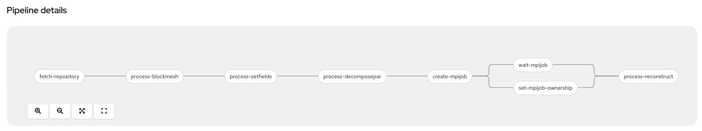

# Kubeflow and the MPI Operator on OpenShift

This repository provides an example of using
[Kubeflow](https://www.kubeflow.org/) and its [MPI
operator](https://github.com/kubeflow/mpi-operator) on top of
[OpenShift](https://www.redhat.com/en/technologies/cloud-computing/openshift).
The examples specifically target running [OpenFOAM](https://openfoam.org/) CFD
simulations with CPUs and GPUs. It uses [OpenShift Data
Foundation](https://www.redhat.com/en/technologies/cloud-computing/openshift-data-foundation)
for providing RWX storage. It additionally uses [OpenShift
Pipelines](https://docs.openshift.com/container-platform/4.12/cicd/pipelines/understanding-openshift-pipelines.html),
bsed on the upstream [Tekton](https://tekton.dev/) project.

## Background
The growing adoption of Kubernetes provides a new opportunity to shed legacy HPC
infrastructures. Kubernetes is effectively a general purpose scheduling system
for containers. As many MPI-based workloads are already written on Linux, they
can be easily containerized. The Kubeflow project has an early-stage operator
that handles MPI applications. 

OpenFOAM is an application suite used for computational fluid dynamics (CFD)
analysis. It is capable of processing large jobs in parallel using MPI. These
jobs frequently involve large numbers of processors (CPUs). For an organization
with a large Kubernetes cluster at its disposal, making use of these large
processor pools to perform MPI jobs in their spare time seems logical. Further,
in cloud-based environments like AWS (where this example is designed to run),
organizations can make use of the autoscaling features inside Kubernetes to
simply create the capacity required to fulfill the MPI job's requirements.

CI/CD pipelines are commonly used in software development lifecycle situations
where various steps (sequential or parallel) are required as part of building
and deploying software. However, these steps have some parallels in HPC
applications. In HPC applications, it is common to perform many pre- and
post-processing steps on the data that will ultimately be processed in the main
HPC job. OpenFOAM is a perfect example of this parallel, as performing OpenFOAM
analyses requires various pre- and post-processing steps.  To that end,
OpenShift Pipelines is used to break the CFD analysis job into discrete pipeline
steps.

Deeper descriptions of MPI, workers, processors, and etc. is outside of the
scope of this example. Knowledge of CFD and OpenFOAM is also outside of the
scope of this example. Some understanding of both MPI and OpenFOAM is assumed,
but not required. A solid grasp of Kubernetes and, to a degree, OpenShift, is
assumed. Some background on OpenShift Pipelines and Tekton is presented, but
further reading is recommended.

## Base Requirements and Prerequisites
This example was constructed on an OpenShift 4.12 cluster using the Kubeflow MPI
Operator version 0.3. It also makes use of an OpenShift Data Foundation (ODF)
CephFS deployment to provide the RWX storage necessary for each of the MPI
workers to access the OpenFOAM data. Finally, it uses OpenShift Pipelines,
included with OpenShift and installed via an operator.

OpenFOAM v9 was used along with some of its parallel processing tutorial
examples. Additionally, a more complicated real-world example of aerodynamic CFD
analysis of vehicles was graciously provided by [Morlind
Engineering](https://morlindengineering.com/).

As of the creation of this example, ODF does not have any non-replicated mode
and, as such, requires at least 3 OpenShift (Kubernetes) nodes to be able to be
properly installed.

### OpenShift
OpenShift 4.12 was installed using the [Installer-Provisioned Infrastructure
(IPI)](https://docs.openshift.com/container-platform/4.12/installing/installing_aws/installing-aws-default.html)
method against an Amazon Web Services (AWS) environment using `m5a.4xlarge`
instance types for the OpenShift worker nodes.

It is assumed that you will also grab the `oc` command-line client, and that you
will be logged into your cluster as some user with `cluster-admin` privileges.

### OpenShift Data Foundation
OpenShift Data Foundation was installed via the OperatorHub within OpenShift as
a user with `cluster-admin` privileges:

* Click _Operators_ -> _OperatorHub_ in the left-hand navigation of the
  _Administrator_ perspective.
* Find the _OpenShift Data Foundation_ operator tile and click it.
* Click _Install_
* Leave all of the default options and click _Install_ again.

The Operator provides the capability for instaling the ODF solution. If you want
to learn more about Operators, you can learn more from the [Operator
Pattern](https://kubernetes.io/docs/concepts/extend-kubernetes/operator/)
documentation.

Once the Operator is installed:

* Click on _Operators_ -> _Installed Operators_ in the left-hand navigation of
  the _Administrator_ perspective.
* Find the `openshift-storage` project at the top in the drop-down menu.

  You may have to toggle the "Show default projects" button to see it.
* Click on the _OpenShift Data Foundation_ Operator.
* Click on the blue _Create StorageSystem_ button.
* Click _Next_ on the first screen.
* Select at least 3 nodes and click _Next_ on the second screen.
* Click _Next_ on the third screen.
* Finally, click _Create StorageSystem_ on the last screen.

Occasionally you may get a 404 error in the OpenShift web console if you have
not sufficiently refreshed the page (eg: Ctrl+F5) and certain content is either
cached or not cached. Go ahead and do a hard browser refresh at this time.

* Click on _Storage_ -> _Data Foundation_ in the left-hand navigation of the _Administrator_ perspective.
* Click on the _Storage Systems_ tab.

You now will want to wait until the _StorageSystem_ status reports as ready. The
ODF operator is currently provisioning all of the resources it needs to be able
to provide a CephFS cluster on top of the storage volumes (which themselves are
on top of AWS EC2 EBS).

### Cluster Autoscaling
Whether or not you want to auto-scale your cluster is up to you. It is trivial
in most Kubernetes environments to add additional nodes to your cluster to
support your desired workload. The big example at the end of this tutorial will
consume 240 cores across a few pods. You will need sufficient nodes in your
cluster to accommodate the cores you want to run.

In OpenShift you use a `ClusterAutoscaler` that enables auto scaling at the
cluster level, and then you create `MachineAutoScaler`s for the `MachineSet`s
you want to enable scaling. For more details on autoscaling OpenShift clusters,
check [the
documentation](https://docs.openshift.com/container-platform/4.12/machine_management/applying-autoscaling.html).

As the configuration of autoscaling involves some details that are highly
specific to your deployed cluster, sample YAML files are not included.

### OpenShift Pipelines
The Pipelines Operator needs to be installed. 

* Click _Operators_ -> _OperatorHub_ in the left-hand navigation of the
  _Administrator_ perspective.
* Make sure the project selector at the top is set to _All Projects_.
* Find the _Red Hat OpenShift Pipelines_ operator tile and click it.
* Click _Install_
* Leave all of the default options and click _Install_ again.

You can then click _Operators_ -> _Installed Operators_ and wait for the
Pipelines operator to be installed.

### Kubeflow MPI Operator
The Kubeflow MPI Operator needs to be installed. The installation process also
creates a `CustomResourceDefinition` for an `mpijob` object, which is how you
will define the MPI job that you want the cluster to run.

You will want to clone the [MPI Operator
repository](https://github.com/kubeflow/mpi-operator.git) somewhere. From the
MPI Operator repository clone folder:

    git checkout v0.3.0
    oc create -f deploy/v2beta1/mpi-operator.yaml

This will create a namespace with all of the required elements to deploy the
operator. Wait for the pod for the MPI Operator to be deployed and ready before
continuing.

Note that the MPI operator will not show up in the _Installed Operators_ area of
OpenShift because it is not being installed via the OperatorHub. The MPI
operator is in active development and is not yet published in the OperaturHub
community catalog.

## MPI Job
The following sections detail getting the MPI data into the cluster and then
running the example MPI job. It is recommended that you deploy the following
assets into their own namespace (Project, in OpenShift parlance). For this
example we will refer to the `cfd` Project.

### CFD Project
Create a new Project in OpenShift called `cfd`. You can do this using the `oc`
CLI or the web console.

### Security Context Constraints (SCC)
OpenShift layers additional security features and defaults on top of vanilla
Kubernetes. One of these things is SCCs. You can learn about [Security Context
Constraints
here](https://docs.openshift.com/container-platform/4.9/authentication/managing-security-context-constraints.html).
By default, OpenShift does not allow containers to run as specific users/UIDs,
and it randomizes them. While OpenSSH (for MPI) and OpenFOAM can be made to work
with completely randomized UIDs, it's a lot of effort, and, for this example, it
was decided to relax the SCC defaults to allow `AnyUID`:

    oc adm policy add-scc-to-user anyuid -z default -n cfd

The above command allows the `default` ServiceAccount to use the `anyuid` SCC
when it deploys Pods. This means that our OpenFOAM pod, which wants to be user
`98765`, can be.

### Persistent Volume Claim
You will need some storage to attach the file manager and the CFD workers to. Be
sure to create the following file in the Project you created:

    oc create -f manifests/foam-pvc.yaml -n cfd

This PVC assumes that you used the default storage class names when you deployed
OpenShift Data Foundation.

Check the status of the PVC to make sure that it is successfully bound.

### OpenFOAM MPI Launcher/Worker Container Image
Podman was used locally to build the OpenFOAM container image to go with the MPI
operator. You can find its `Containerfile` and supporting files in this
repository. The image is also currently being hosted on Quay.io:
[https://quay.io/repository/openshiftdemos/kubeflow-mpi-openfoam](https://quay.io/repository/openshiftdemos/kubeflow-mpi-openfoam)

The MPI operator uses a concept of a Launcher pod (which is where `mpirun`
originates) and Worker pods, which are the targets of the `mpirun` command.
There is no reason that both the Launcher and the Worker cannot be the same
container image. This tutorial uses the same container image for both. The only
advantage to using different container images is that the OpenFOAM image is
quite large. If the Launcher ends up on a different node than the Workers, it
means the image will be pulled more than once, which can take a long time, or
incur network charges.

### OpenFOAM Pipeline Task
Tekton implements pipelines as a series of `Tasks` and `Steps`. Each of the pre-
and post-processing activities for OpenFOAM could be thought of as discrete
`Tasks`. Each of these `Tasks` are really just a single OpenFOAM command being
run in a container. In the case of this example, that container is running the
OpenFOAM image.

Since all of these `Tasks` are nearly identical except for the specific command
from the OpenFOAM toolkit that is run, a common `openfoam-command-task` can be
used and then parameterized. You can add that OpenFOAM task to your cluster with
the provided YAML:

    oc create -n cfd -f manifests/tekton/openfoam-command-task.yaml

### OpenFOAM Pipeline
The entire pipeline to perform an analysis using the OpenFOAM library's
`damBreak` example is provided:

    oc create -n cfd -f manifests/dambreak/dambreak-pipeline.yaml

After creating this pipeline, in the OpenShift web console, switch to the
_Developer_ perspective. Then, make sure you select the `cfd` project from the
project selector at the top of the page. 

Next, click _Pipelines_ in the left-side navigation, and choose the
`dambreak-pipeline` by clicking it. You should see the graphical representation
of the pipeline as follows:



The pipeline involves the following tasks:

1. clone this example repository
1. blockMesh
1. setFields
1. decomposePar
1. create MPI job
1. wait for the MPI job to finish
1. set the ownership
1. reconstructPar

You might be wondering about the create, wait, and ownership tasks.

The MPI operator only knows how to work with `mpijob` Kubernetes objects. There
is no triial way to have a Tekton task do the MPI job. But a Tekton task is
simply a container that is run. Nothing prevents that container from accessing
the Kubernetes API. In the case of this pipeline, one of the steps is creating
the `mpijob` object.

Next, as the MPI job will take a considerable amount of time to complete, Tekton
needs to wait for this before the pipeline can continue. The waiting step
involves the use of the underlying `kubectl wait` subcommand. In this case, one
must wait for the MPI job to reach the `succeeded` condition.

Different analysis jobs can take very different amounts of time to complete.
Hopefully you have some idea about the order of magnitude of how long it will
take for your MPI job to complete, and can set an appropriate timeout. 

Lastly, the set ownership task helps with cleaning up. Tekton sets proper
Kubernetes `ownerReference` information for all of the resources it creates.
Because the `mpijob` is being created out-of-band, so to speak, it was useful to
additionally set the `ownerReference` so that the MPI job would be deleted when
the pipeline run would be deleted. If you dig into the pipeline's YAML
definition, you can see the special parameters that were used and the `oc patch`
command that sets the owner reference.

### Pipeline ServiceAccount Permissions
The default `ServiceAccount` that pipelines use does not have wide-ranging
permissions to act on the namespace where the pipeline is running. In order to
allow this `ServiceAccount` to create the `mpijob` and to modify it, you will
need to first create a role with the following permissions:

    oc create role mpi-pipeline --verb=* --resource=mpijobs

Then you need to give the `ServiceAccount` that role:

    oc policy add-role-to-user mpi-pipeline --role-namespace=cfd -z pipeline
    
You could alternatively choose to run the pipeline as a different and more
widely-privileged `ServiceAccount`, but the process outlined above offers a
"least privilege" approach to minimizing any possible security risks.

### OpenFOAM PipelineRun
At this point, you are ready to run your MPI job pipeline to perform the
`damBreak` analysis. While the OpenShift web console offers a fairly robust
interface for configuring pipeline runs, this particular pipeline needs to use
the OpenFOAM Linux user account, and that cannot be configured via the web
console.

A `pipelinerun` file has been provided for you. You can see that it specifies
the pipeline should run all pods using the `98765` user ID. This ensures that
anything created or manipulated as a part of the pipeline is done with the
specific user and avoids filesystem permission issues that crop up when you
don't specify this.

The `pipelinerun` also uses a `generateName` stanza to make it easier to run
the pipeline multiple times (in case there is some kind of failure).

Go ahead and kick off the `pipelinerun` by creating the file:

    oc create -f manifests/dambreak/dambreak-pipelinerun.yaml

You should see the pipeline progressing through the various `Tasks`:


**NOTE:** It may take some time for the `Tasks` to start because they are all
backed by the rather large OpenFOAM container image which needs to be pulled the
first time it is run on any particular node.

With four processors on an m5a.4xlarge instance type, this job takes 800 seconds
or less depending on how fast your cluster is able to fetch the container
images, and other factors. In the interim, in the _Developer_ perspective, click
_Project_ on the left-hand navigation and then click _Pods_. You will see a long
list of pods because each `Task` in the pipeline was being executed in its own
pod. 

An example picture from OpenShift's metrics dashboard shows the project in action:


## Slots per Worker
In our example we used a replica count of 2 on the Workers, but specified `-np
4` for `mpirun`. How does this work? In the MPI job we have specified
`slotsPerWorker: 2` which causes the MPI operator to configure the MPI `hosts`
file to specify that each worker has 2 _slots_, or processors. The MPI job
further includes a limit/request for 2 CPUs for each Worker pod. If you were to
`rsh` or `exec sh` into one of the worker pods and execute `top`, you would see
that two cores are being used:

```
...
    152 openfoam  20   0  312992  98708  80856 R  96.7   0.2   3:09.63 interFoam                                                                                                                                                              
    151 openfoam  20   0  313084  98752  80780 R  96.3   0.2   3:08.58 interFoam      
...
```

Depending on the nature of your environment, you may wish to run more
`slotsPerWorker` in order to reduce the total number of Pods that get scheduled
by the MPI operator. There are varying support limits for the number of
pods-per-node depending on your Kuberetes distribution. As of the 4.12 release,
OpenShift supports 500 pods per node and this is the default limit. If you were
running your environment directly on very large hardware with a huge number of
cores, having `slotsPerWorker: 1` could result in attempting to schedule too
many pods on your nodes and the resulting MPI job would fail.

Also, attempting to schedule very large numbers of pods simultaneously can
result in system instability. On the flip side, trying to fit larger Pods that
require more cores can also be challenging if your MPI job is running in an
otherwise busy Kubernetes cluster. Lastly, each Pod is making a connection to
the storage system, which results in higher throughput (on the network) and more
disk access when the initial data is loaded. Finding a good balance of slots
versus Pod size versus total Pods will be dependent on your environment.

## Other Examples
There are two other examples and corresponding manifests included in this
repository.

### Motorbike
The motorbike example is included with the OpenFoam project, just like the dam
break example.


It is configured for 12 total processors with 6 slots per worker and 2 pods. It
took about 20 minutes in our environment, and you can also see the dam break job
that took place right before it:


Running this particular sequence of OpenFOAM commands as a pipeline actually
took meaningfully longer than if all of the commands were executed by a single
MPI job item. This has to do with scheduling, startup, and shutdown of the
various pods associated with the pipeline. While this pipeline took about 20
minutes, the non-pipelined job version takes less than 10. 

For pipelines with a very large number of Tasks and a very short processing
time, this difference may be very meaningful. However, for a job that has very
long processing time for some steps, it may be less impactful.

### Morlind Engineering Wing
[Morlind Engineering](http://morlindengineering.com/) was kind enough to lend us
a model and some other relevant OpenFOAM files for one of their race car
airfoils:


There are example manifests included for this job as well. However, in the
interest of time (to conduct this experiment), the Morlind Wing example was not
converted to use Tekton Pipelines. It still uses a single `MPIJob` and further
simplifies things by eliminating the use of the `ConfigMap` to hold the script,
instead putting the command sequence directly into the `MPIJob` definition,
including logging redirection.

The job took about 5 hours in our example environment when using `c6i.24xlarge`
instances, 94 slots per worker (close to the full core count of the instance
type), pods with 94 CPUs, 3 worker replica pods (representing 282 total cores)
and a job requesting 240 procs. This is a setup that is fairly similar to
Morlind's in terms of physical (virtual) instance count, total number of cores,
and etc. It also did not use any Tekton Pipelines which eliminates any
start-up/spin-down time associated. This is roughly the same amount of
processing time that the job took for [V1 of this
experiment](https://github.com/OpenShiftDemos/kubeflow-mpi-openfoam/tree/v1.0.0)
despite using compute-optimized instance types and very vew, very large pods. 

It's unclear at this time why the performance of this workload is not on-par
with Morlind's own lab despite using newer architecture processors on
compute-optimized instances. Further investigation is required but is outside
the scope of this experiment.

## Summary
This experiment did not set out to prove that OpenShift running on AWS was the
best and/or most performant environment to run your HPC workloads (specifically
OpenFOAM). Rather, it set out to prove that in an organization that already has
widely adopted Kubernetes there may be no need to to continue to maintain a
separate/discrete HPC infrastructure, especially if that infrastructure lays
dormant much of the time.

It also did not set out to prove that Tekton Piplnes are the best way to handle
the various pre, post, and processing steps of an HPC workload. It merely set
out to show how it _could_ be done. 

Even if one were to assume that the reduced performance was simply the way
things are, a serious consideration needs to be made when contemplating the
total ownership and operational cost of an HPC cluster that lays dormant versus
running those workloads on Kubernetes on-demand. Granted, cloud has its own cost
associated with it, but this, too, is a key consideration when evaluating the
cost-per-performance-unit of traditional HPC clusters versus Kubernetes-based
HPC processing.