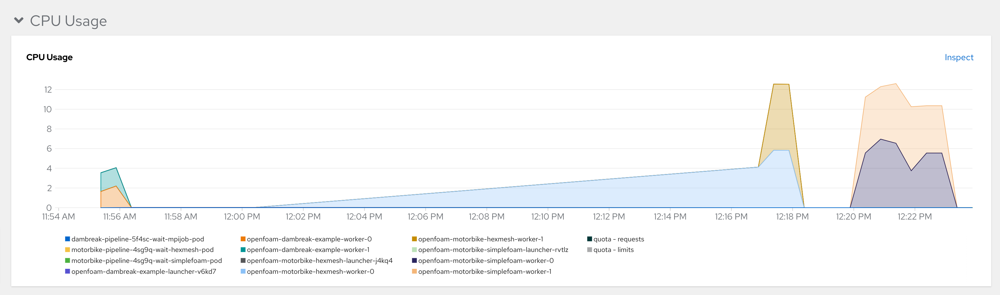

# Kubeflow and the MPI Operator on OpenShift

This repository provides an example of using
[Kubeflow](https://www.kubeflow.org/) and its [MPI
operator](https://github.com/kubeflow/mpi-operator) on top of
[OpenShift](https://www.redhat.com/en/technologies/cloud-computing/openshift).
The examples specifically target running [OpenFOAM](https://openfoam.org/) CFD
simulations with CPUs and GPUs. It uses [OpenShift Data
Foundation](https://www.redhat.com/en/technologies/cloud-computing/openshift-data-foundation)
for providing RWX storage.

## Background
The growing adoption of Kubernetes provides a new opportunity to shed legacy HPC
infrastructures. Kubernetes is effectively a general purpose scheduling system
for containers. As many MPI-based workloads are already written on Linux, they
can be easily containerized. The Kubeflow project has an early-stage operator
that handles MPI applications. 

OpenFOAM is an application suite used for computational fluid dynamics (CFD)
analysis. It is capable of processing large jobs in parallel using MPI. These
jobs frequently involve large numbers of processors (CPUs). For an organization
with a large Kubernetes cluster at its disposal, making use of these large
processor pools to perform MPI jobs in their spare time seems logical. Further,
in cloud-based environments like AWS (where this example is designed to run),
organizations can make use of the autoscaling features inside Kubernetes to
simply create the capacity required to fulfill the MPI job's requirements.

Deeper descriptions of MPI, workers, processors, and etc. is outside of the
scope of this example. Knowledge of CFD and OpenFOAM is also outside of the
scope of this example. Some understanding of both MPI and OpenFOAM is assumed,
but not required. A solid grasp of Kubernetes and, to a degree, OpenShift, is
assumed.

## Base Requirements and Prerequisites
This example was constructed on an OpenShift 4.9 cluster using the Kubeflow MPI
Operator version 0.3. It also makes use of an OpenShift Data Foundation (ODF)
CephFS deployment to provide the RWX storage necessary for each of the MPI
workers to access the OpenFOAM data. 

OpenFOAM v9 was used along with some of its parallel processing tutorial
examples. Additionally, a more complicated real-world example of aerodynamic CFD
analysis of vehicles was graciously provided by Morlind Engineering. As of the
creation of this example, ODF does not have any non-replicated mode and, as
such, requires at least 3 OpenShift (Kubernetes) nodes to be able to be properly
installed.

The following subsections detail the steps to prepare to run the `damBreak`
example.

### OpenShift
OpenShift 4.9 was installed using the [Installer-Provisioned Infrastructure
(IPI)](https://docs.openshift.com/container-platform/4.9/installing/installing_aws/installing-aws-default.html)
method against an Amazon Web Services (AWS) environment using `m5a.4xlarge`
instance types for the OpenShift worker nodes.

It is assumed that you will also grab the `oc` command-line client, and that you
will be logged into your cluster as some user with `cluster-admin` privileges.

### OpenShift Data Foundation
OpenShift Data Foundation was installed via the OperatorHub within OpenShift as
a user with `cluster-admin` privileges:

* Click _Operators_ -> _OperatorHub_ in the left-hand navigation of the
  _Administrator_ perspective.
* Find the _OpenShift Data Foundation_ operator tile and click it.
* Click _Install_
* Leave all of the default options and click _Install_ again.

The Operator provides the capability for instaling the ODF solution. If you want
to learn more about Operators, you can learn more from the [Operator
Pattern](https://kubernetes.io/docs/concepts/extend-kubernetes/operator/)
documentation.

Once the Operator is installed:

* Click on _Operators_ -> _Installed Operators_ in the left-hand navigation of
  the _Administrator_ perspective.
* Find the `openshift-storage` project at the top in the drop-down menu.
* Click on the _OpenShift Data Foundation_ Operator.
* Click on the blue _Create StorageSystem_ button.
* Click _Next_ on the first screen.
* Select at least 3 nodes and click _Next_ on the second screen.
* Click _Next_ on the third screen.
* Finally, click _Create StorageSystem_ on the last screen.

Occasionally you may get a 404 error in the OpenShift web console if you have
not sufficiently refreshed the page (eg: Ctrl+F5) and certain content is either
cached or not cached. Go ahead and do a hard browser refresh at this time.

* Click on _Storage_ -> _OpenShift Data Foundation_ in the left-hand navigation of the _Administrator_ perspective.
* Click on the _Storage Systems_ tab.

You now will want to wait until the _StorageSystem_ status reports as ready. The
ODF operator is currently provisioning all of the resources it needs to be able
to provide a CephFS cluster on top of the `gp2` storage volumes (which
themselves are on top of AWS EC2 EBS).

### Cluster Autoscaling
Whether or not you want to auto-scale your cluster is up to you. It is trivial
in most Kubernetes environments to add additional nodes to your cluster to
support your desired workload. The big example at the end of this tutorial will
consume 512 cores across many pods. You will need sufficient nodes in your
cluster to accommodate the cores you want to run.

In OpenShift you use a `ClusterAutoscaler` that enables auto scaling at the
cluster level, and then you create `MachineAutoScaler`s for the `MachineSet`s
you want to enable scaling. For more details on autoscaling OpenShift clusters,
check [the
documentation](https://docs.openshift.com/container-platform/4.9/machine_management/applying-autoscaling.html).

As the configuration of autoscaling involves some details that are highly
specific to your deployed cluster, sample YAML files are not included.

### Kubeflow MPI Operator
The Kubeflow MPI Operator needs to be installed. The installation process also
creates a `CustomResourceDefinition` for an `mpijob` object, which is how you
will define the MPI job that you want the cluster to run.

You will want to clone the [MPI Operator
repository](https://github.com/kubeflow/mpi-operator.git) somewhere. From the
MPI Operator repository clone folder:

* `git checkout v0.3.0`
* `oc create -f deploy/v2beta1/mpi-operator.yaml`

This will create a namespace with all of the required elements to deploy the
operator. Wait for the pod for the MPI Operator to be deployed and ready before
continuing.

## MPI Job
The following sections detail getting the MPI data into the cluster and then
running the example MPI job. It is recommended that you deploy the following
assets into their own namespace (Project, in OpenShift parlance). For this
example we will refer to the `cfd` Project.

### CFD Project
Create a new Project in OpenShift called `cfd`. You can do this using the `oc`
CLI or the web console.

### Security Context Constraints (SCC)
OpenShift layers additional security features and defaults on top of vanilla
Kubernetes. One of these things is SCCs. You can learn about [Security Context
Constraints
here](https://docs.openshift.com/container-platform/4.9/authentication/managing-security-context-constraints.html).
By default, OpenShift does not allow containers to run as specific users/UIDs,
and it randomizes them. While OpenSSH (for MPI) and OpenFOAM can be made to work
with completely randomized UIDs, it's a lot of effort, and, for this example, it
was decided to relax the SCC defaults to allow `AnyUID`:

    oc adm policy add-scc-to-user anyuid -z default -n cfd

The above command allows the `default` ServiceAccount to use the `anyuid` SCC
when it deploys Pods. This means that our OpenFOAM pod, which wants to be user
`98765`, can be.

### Persistent Volume Claim
You will need some storage to attach the file manager and the CFD workers to. Be
sure to create the following file in the Project you created:

    oc create -f manifests/filemanager-pvc.yaml -n cfd

This PVC assumes that you used the default storage class names when you deployed
OpenShift Data Foundation.

Check the status of the PVC to make sure that it is successfully bound.

### Tiny File Manager
There are supporting manifests in the `manifests` folder for deploying a
PHP-based file manager program, [Tiny File
Manager](https://tinyfilemanager.github.io/), and a corresponding volume claim.
The `PersistentVolumeClaim` will grab a small amount of RWX storage, and you can
then upload the `damBreak` example from the `examples` folder in order to do
your pre-processing.

A [separate
repository](https://github.com/OpenShiftDemos/tinyfilemanager-php-ubi) has a
`Containerfile` which can be used to build the Tiny File Manager into a RHEL8
UBI-based Apache and PHP S2I image. Although Source-to-Image (S2I) was not used
to build the resulting container, the RHEL8 UBI Apache S2I image already has the
proper security modifications in order to easily be used in an OpenShift
environment. You can find more information about the [S2I image
here](https://github.com/sclorg/s2i-php-container). The image is also hosted on
Quay.io:
[https://quay.io/repository/openshiftdemos/tinyfilemanager-php-ubi](https://quay.io/repository/openshiftdemos/tinyfilemanager-php-ubi)

You can deploy the file manager with the following:

    oc create -f manifests/filemanager-assets.yaml -n cfd

This will also create a Service and a Route so that you can access the file
manager outside the cluster. Check the URL for the Route. Note that HTTPS is
_not_ enabled for this route. The effective URL to use is (make sure to check
your own base FQDN):

    http://filemanager-cfd.apps.mpi.ocp4testing.openshiftdemos.com/tinyfilemanager.php

The default username and password for Tiny File Manager is used:

    admin / admin@123

* In the Tiny File Manager, click into the `storage` folder
* Click the `Upload` button at the top right.
* Drag the local `damBreak` folder (from this repository)
  into the file manager window to upload it recursively
  
That's it!

### OpenFOAM MPI Launcher/Worker Container Image
Podman was used locally to build the OpenFOAM container image to go with the MPI
operator. You can find its `Containerfile` and supporting files in this
repository. The image is also currently being hosted on Quay.io:
[https://quay.io/repository/openshiftdemos/kubeflow-mpi-openfoam](https://quay.io/repository/openshiftdemos/kubeflow-mpi-openfoam)

The MPI operator uses a concept of a Launcher pod (which is where `mpirun`
originates) and Worker pods, which are the targets of the `mpirun` command.
There is no reason that both the Launcher and the Worker cannot be the same
container image. This tutorial uses the same container image for both.

OpenFOAM's CFD analysis process involves several steps. You can actually perform
some of the pre- and post-processing steps inside a running container using
`rsh` or `exec`. However, you can also include the steps in your pre- and
post-processing in a script, and then mount that script into the Launcher pod
and make that script be the entry execution point of the Launcher. We have
staged precisely that scenario for you in the subsequent steps.

### OpenFOAM MPI Script ConfigMap
An easy way to mount files into a container in Kubernetes is using a
`ConfigMap`. The sequence of steps in performing the _damBreak_ MPI job is
contained in a bash script in the `dambreak-configmap.yaml` file. Go ahead and
create this `ConfigMap`:

    oc create -f manifests/dambreak-configmap.yaml -n cfd

### OpenFOAM MPI Job
At this point you are ready to run your OpenFOAM MPI job. Take a look at the
`mpijob-dambreak-example.yaml` manifest to see the structure of an `mpijob`. The
MPI Operator repository provides more details. To paraphrase, our `mpijob` has 4
worker Replicas, and our `mpirun` command specifies 4 processors. Both the
Launcher and the Worker are both using our OpenFOAM image, and the rest of the
arguments to `mpirun` come from the OpenFOAM project. Go ahead and create the
`mpijob` manifest now:

    oc create -f manifests/mpijob-dambreak-example.yaml -n cfd

When you look at the Pods that are subsequently created, you will notice that
the launcher reports an `Error` state and ends up in a `CrashLoopBackoff`. This
is because of [this
issue](https://github.com/kubeflow/mpi-operator/issues/288#issuecomment-1011101805)
which is related to how OpenShift handles DNS resolution of service names.

Eventually the launcher should get into `Running` state. If you check its logs,
you will see a lot of this:

```
smoothSolver:  Solving for alpha.water, Initial residual = 0.00193684, Final residual = 3.40587e-09, No Iterations 3
Phase-1 volume fraction = 0.124752  Min(alpha.water) = -2.76751e-09  Max(alpha.water) = 1
MULES: Correcting alpha.water
MULES: Correcting alpha.water
Phase-1 volume fraction = 0.124752  Min(alpha.water) = -2.76751e-09  Max(alpha.water) = 1
DICPCG:  Solving for p_rgh, Initial residual = 0.0343767, Final residual = 0.0016133, No Iterations 5
time step continuity errors : sum local = 0.000480806, global = -4.75907e-08, cumulative = 7.68955e-05
DICPCG:  Solving for p_rgh, Initial residual = 0.00181566, Final residual = 8.38192e-05, No Iterations 33
time step continuity errors : sum local = 2.42908e-05, global = 3.04705e-06, cumulative = 7.99426e-05
DICPCG:  Solving for p_rgh, Initial residual = 0.000251337, Final residual = 8.59604e-08, No Iterations 109
time step continuity errors : sum local = 2.49879e-08, global = -9.43014e-10, cumulative = 7.99416e-05
ExecutionTime = 22.2 s  ClockTime = 23 s

Courant Number mean: 0.076648 max: 1.01265
Interface Courant Number mean: 0.00417282 max: 0.936663
deltaT = 0.0010575
Time = 0.11616
```

It's working!

With four processors on an m5a.4xlarge instance type, this job takes 800 seconds
or less depending on how fast your cluster is able to fetch the container
images, and other factors.

An example picture from OpenShift's metrics dashboard shows the project in action:


## Slots per Worker
In our example we used a replica count of 2 on the Workers, but specified `-np
4` for `mpirun`. How does this work? In the MPI job we have specified
`slotsPerWorker: 2` which causes the MPI operator to configure the MPI `hosts`
file to specify that each worker has 2 _slots_, or processors. The MPI job
further includes a limit/request for 2 CPUs for each Worker pod. If you were to
`rsh` or `exec sh` into one of the worker pods and execute `top`, you would see
that two cores are being used:

```
...
    152 openfoam  20   0  312992  98708  80856 R  96.7   0.2   3:09.63 interFoam                                                                                                                                                              
    151 openfoam  20   0  313084  98752  80780 R  96.3   0.2   3:08.58 interFoam      
...
```

Depending on the nature of your environment, you may wish to run more
`slotsPerWorker` in order to reduce the total number of Pods that get scheduled
by the MPI operator. There are varying support limits for the number of
pods-per-node depending on your Kuberetes distribution. OpenShift currently
supports 250 pods per node and this is the default limit. If you were running
your environment directly on very large hardware with a huge number of cores,
having `slotsPerWorker: 1` could result in attempting to schedule too many pods
on your nodes and the resulting MPI job would fail.

Also, attempting to schedule very large numbers of pods simultaneously can
result in system instability. On the flip side, trying to fit larger Pods that
require more cores can also be challenging if your MPI job is running in an
otherwise busy Kubernetes cluster. Lastly, each Pod is making a connection to
the storage system, which results in higher throughput (on the network) and more
disk access. Too many Pods will eventually decrease performance as the storage
subsystem starts to become a limiting factor. Finding a good balance of slots
versus Pod size versus total Pods will be dependent on your environment.

## Other Examples
There are two other examples and corresponding manifests included in this
repository.

### Motorbike
The motorbike example is included with the OpenFoam project, just like the dam
break example.


It is configured for 12 total processors with 2 slots per worker and 6 pods. It
took about 8 minutes in our environment, and you can also see the dam break job
that took place right before it:



### Morlind Engineering Wing
[Morlind Engineering](http://morlindengineering.com/) was kind enough to lend us
a model and some other relevant OpenFOAM files for one of their race car
airfoils:


There are example manifests included for this job as well. While it is currently
set up for 512 processors, with 2 slots per worker and 256 pods, this is not an
optimal configuration. The job took about 5 hours in our example environment,
which is not great compared to Morlind's own physical server cluster running
OpenFOAM with only half the processors. This is likely due to storage
throughput, poor subdivision of the job, and lots of small jobs.

With some care and tweaking, you could easily find different Amazon instance
types with faster storage, better CPUs, and different slots-per-worker and pod
count configurations that would dramatically improve performance.

Using something much larger, such as an EC2 c6i.24xlarge compute-optimized
instance, would likely offer better results. This instance type has 96 cores,
and would allow you to run your job with 90+ slots-per-worker (leaving some
headroom for OpenShift's node processes) across 3 pods / 3 nodes which would be
a minimum of 270 cores.

Additionally, OpenShift Data Foundations is running on non-storage-optimized
hosts with basic GP2 storage. This likely also leaves room for improvement.
